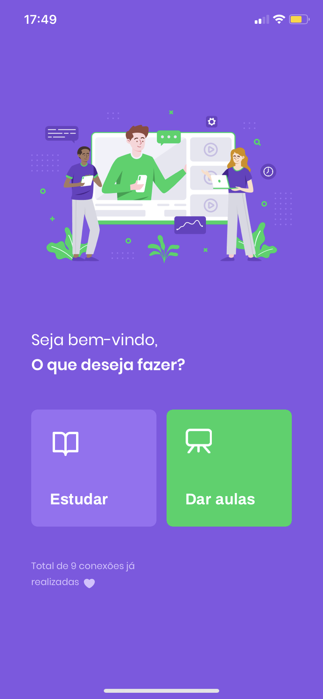
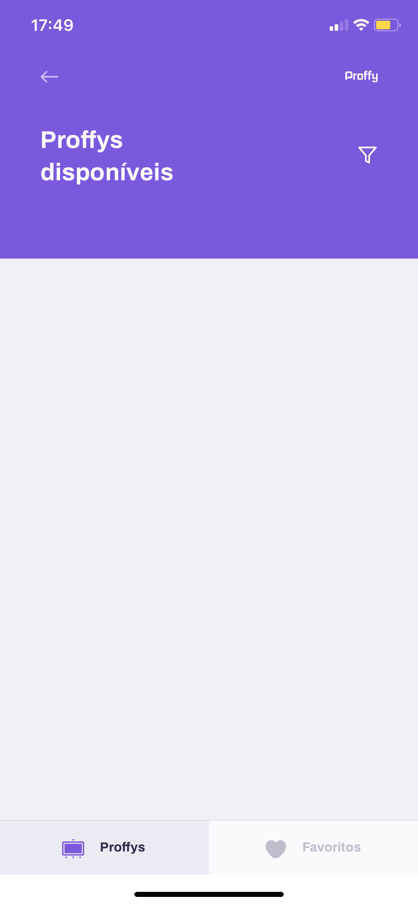
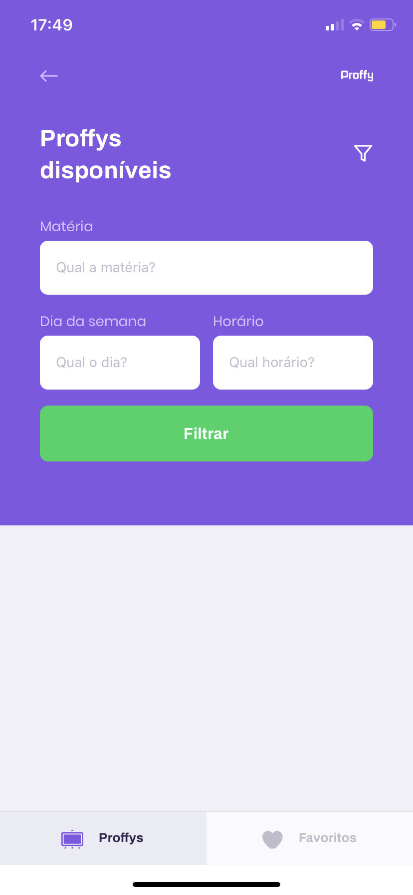
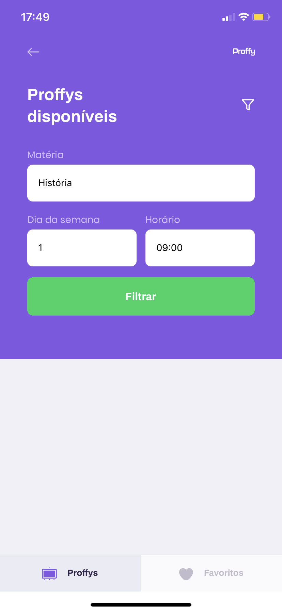
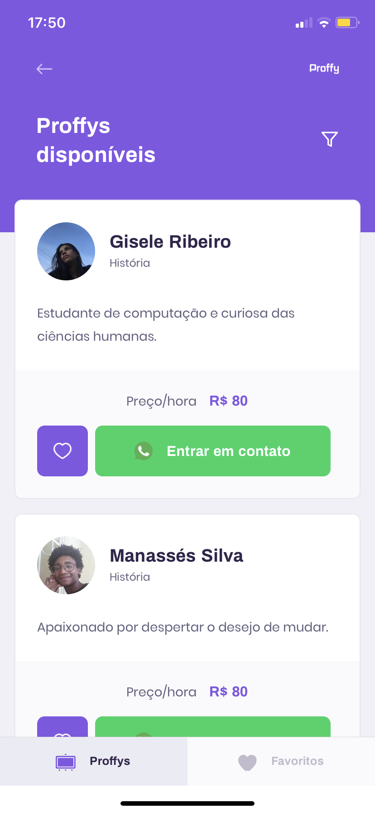
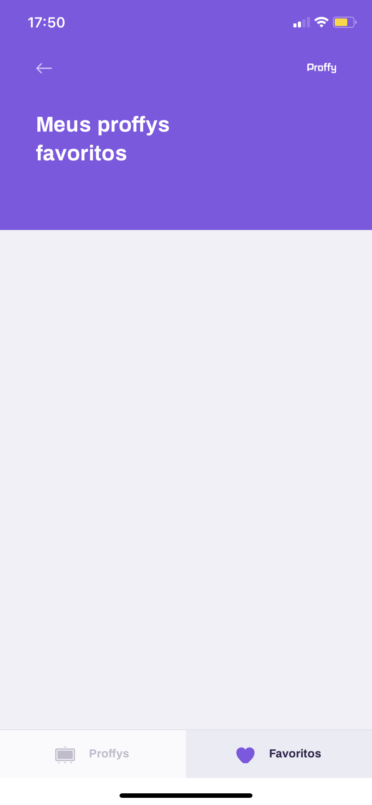
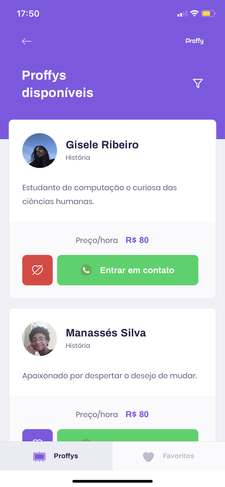
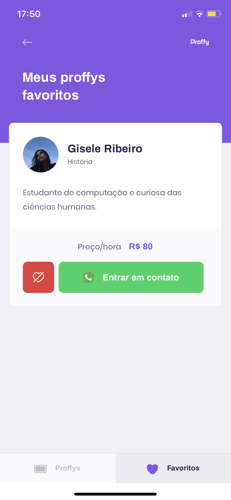

# :rocket: Next Level Week #2 - Mobile :beginner:

O projeto se trata da implementação de uma plataforma de estudos online, onde o usuário pode se cadastrar como professor ou aluno e buscar pelos professores disponíveis em um determinado dia da semana e em um determinado horário.
O repositório tem como objetivo registrar o conhecimento obtido durante toda a semana. Todos os códigos envolvidos estão comentados de maneira a se extrair o máximo de informação possível das aulas.

# :computer: Screens

## Landing

## TeacherForm

## TeacherList

## Favorites

